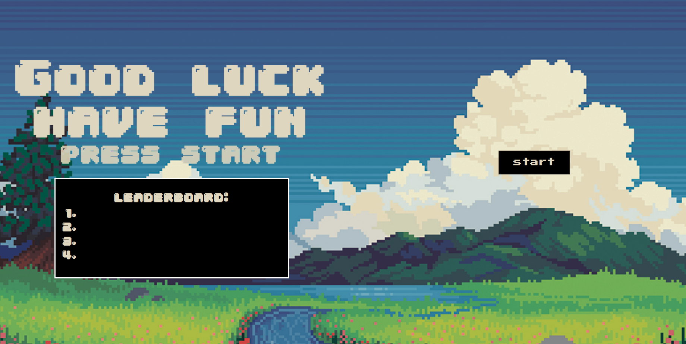
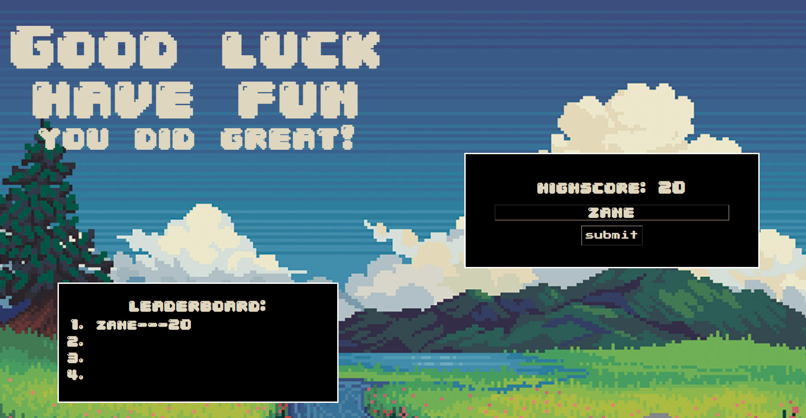

# Pop-Quiz



Even though I had some hiccups along the way this was by far my favorite project of the bootcamp.

I build the quiz in the most simple straighforward way that I could:
```
function showQuestion() {
    questionEl.text('How many times can the earth fit into the sun')
    aEl.text('1,000')
    bEl.text('10,000')
    cEl.text('100,000')
    dEl.text('1,000,000')

    if(dEl.click( () => [
        finalScore++,
        questionTwo(),
        
    ]));
    if(aEl.click( () => [
        wrongAnswers++,
        questionTwo(),
        
    ]));
    if(bEl.click( () => [
        wrongAnswers++,
        questionTwo(),
        
    ]));
    if(cEl.click( () => [
        wrongAnswers++,
        questionTwo(),
        
    ]));
```
I essentially set up each question in my quiz as a function and when a button is clicked it will add to either your final score tally or your wrong question tally and then fire off the next question function. the function above is the meat and potatoes of the program and pretty much runs as intended. 

# Future Work

I am still running into issues with running local storage and saving my scores on the leaderboard. That is something that will be worked on and added in the next couple of days. 

I am also looking into building a 'health' bar into the game so if you miss enough questions then the game will automatically end 


I also will be adding some music to the game: To signify if a question is right or wrong as well as some nice background.

# Live Application

https://zane-gilfillan.github.io/Quiz/

